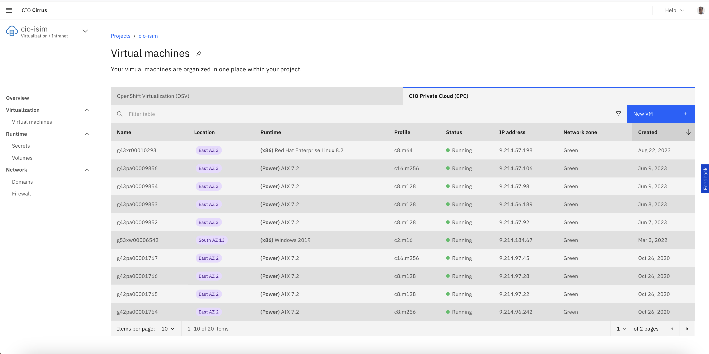

# AIX Hosts

## Specs

| Host Name       | CPU Cores | RAM (GB) | Storage (GB) | OS                   |
|-----------------|-----------|----------|--------------|----------------------|
| LDAP            | 8         | 128      | 2 x 100 GiB / 1 x 200 GiB | AIX 7.2 |
| DB2             | 16        | 256      | 5 x 1000 GiB              | AIX 7.2 |
| WAS 1           | 8         | 128      | 3 x 100 GiB / 3 x 200 GiB | AIX 7.2 |
| WAS 2           | 8         | 128      | 4 x 100 GiB / 1 x 200 GiB | AIX 7.2 |

